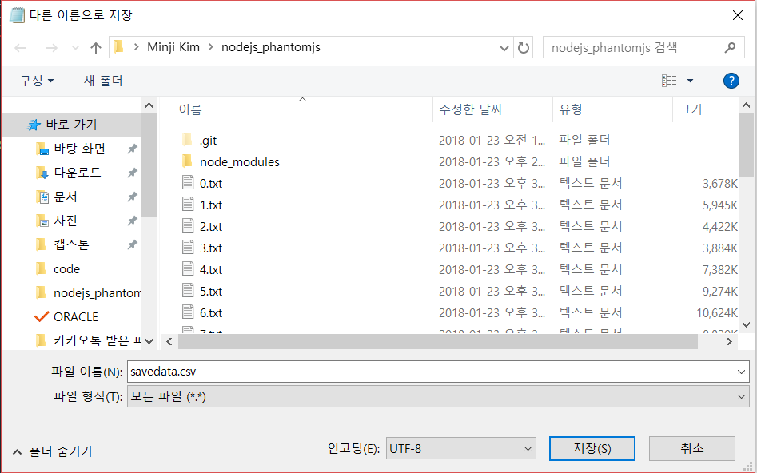

Node js를 이용한 Web Crawling
===

1. 개발 환경 세팅
--
cmd창에서 파일 폴더 디렉토리로 이동합니다.
~~~
$ npm init
$ npm install request
$ npm install cheerio
$ npm install --save cheerio-httpcli
$ npm install --save officegen
~~~

2. 기초 코드 세팅
--
웹 크롤링의 기본이 되는 초기 코드를 로컬 환경에 저장하세요.
~~~
var cheerio = require('cheerio');  
var request = require('request');

var options = {
   encoding: "UTF-8",
   uri: "http://terms.naver.com/"    
}
request(options, function(error, response, html){  //url
    if (error) {throw error};

    var $ = cheerio.load(html);
    var result3 = $(".stress"); //클래스 이름          <- text()메소드 뺌.
    var result4 = $("#TABLE_OF_CONTENT4"); //id 값

   //result3.replace(/(^\s+|\s+$)/g, "");     
   // 앞뒤의 화이트 스페이스를 제거 가능

   var result5 = result4.next().text(); //그다음 태그의 string만 가져오기
   //표 내부 스트링에 직접 접근이 불가능 할 때 사용합니다.

    console.log("RESULT ---> " + result5);

});
~~~

3. 크롤링이 필요한 사이트와 내용을 설정
--

크롤링 할 페이지가 여러 페이지라면 페이지를 구분하는 drugid 라는 인자를 추가합니다.
~~~
var cheerio = require('cheerio');  
var request = require('request');

var drugid = 2140902;
...
~~~
크롤링 하고 싶은 페이지 수 만큼 for문을 이용해 방문합니다.
~~~
for(var i=0; i<1000; i++){
  drugid++;
  drugid+="";//drugid를 string 형으로 변환
  ...
  ~~~

options 내에 encoding 형식과 크롤링이 필요한 주소를 넣습니다.
아래의 주소의 경우 docid에 대해 게시물이 구성되므로 docid의 값을 for문을 이용하여 돌아가며 방문합니다.

각 크롤링이 필요한 페이지마다 url형식이 다르므로 확인하시기 바랍니다.
  ~~~
  var options = {
     encoding: "UTF-8",
     uri: "http://terms.naver.com/entry.nhn?docId="+drugid+"&cid=51000&categoryId=51000"
  }
  ...
~~~
request를 통해 크롤링 할 페이지의 어떤 인자를 스크래핑 할지 지정합니다.
이 케이스의 경우 "headword"라는 class의  "TABLE_OF_CONTENT4" 라는 id를 갖는 인자에 접근해 스크래핑 하여 list1에 넣는 방식입니다.

class : .class_name / id : #id_name
~~~
  request(options, function(error, response, html){
      if (error) {throw error};

      var $ = cheerio.load(html);

      var drugname = $(".headword"); //id 값
      var list1 = $("#TABLE_OF_CONTENT4"); //id 값
      var list2 = $("#TABLE_OF_CONTENT5"); //id 값
      var list3 = $("#TABLE_OF_CONTENT6"); //id 값
...
~~~
csv 파일을 만들기 위해 프린트 할 내용을 프린트 하도록 합니다.

이 케이스는 이름!효능효과!용법용량!주의사항 형식으로 프린트 되며
csv파일로 변환 전에 ,(컴마)처리를 한 후 !->,로 변환하여 csv파일로 변환합니다. (자세한 내용은 후에)

~~~
     console.log(drugname.text() +"!"+list1.next().text() +"!"+list2.next().text() +"!"+list3.next().text() +"\n");
  });

  drugid*=1;
}

~~~

4. 코드 실행
----
코드가 있는 디렉토리 내에서 코드를 실행합니다
~~~
$ C:\Users\gomdo> node crawling.js > savedata.txt
~~~
위와 같이 코드를 실행하면 해당 폴더 내에 프린트 하도록 설정한 텍스트 파일이 생성됩니다.



text파일에서 ,를 다른 특수 기호로 바꾼 후 !를 , 로 찾아 바꿉니다.

텍스트 파일을 다른 이름으로 저장 시에 위와 같이 name.csv 형식으로 저장하며
인코딩 형식을 UTF-8로 합니다.
